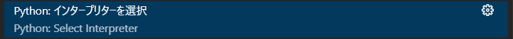
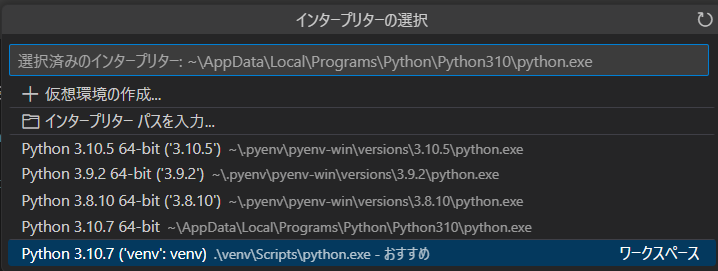
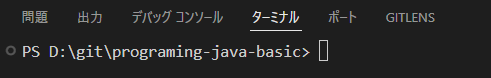
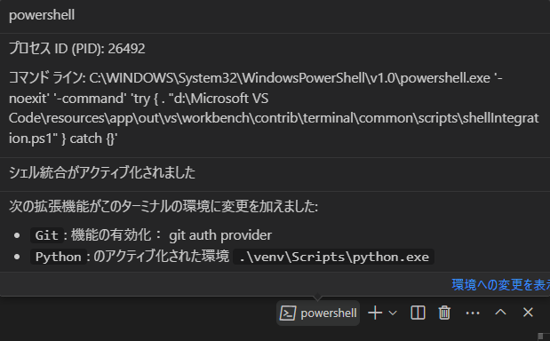

# programing-java-basic

## sphinx 環境準備

python 3.10以降がインストールされている必要があります。

```console
programing-java-basic> python -m venv venv
```

1. `Ctrl + Shift + P`で「Python: インタープリタを選択」を選んでください。
    
1. venv(`.\venv\Scripts\python.exe`)のインタープリタを選択します。
    
1. `Ctrl + Shift + @` で新しいターミナルを開いてください。
    
1. アクティブ化された環境がvenv配下のpython.exeになっていることを確認してください。
    
1. pipを最新にします。
    ```console
    > python -m pip install --upgrade pip
    Requirement already satisfied: pip in d:\git\programing-java-basic\venv\lib\site-packages (22.2.2)
    Collecting pip
    Using cached pip-24.3.1-py3-none-any.whl (1.8 MB)
    Installing collected packages: pip
    Attempting uninstall: pip
        Found existing installation: pip 22.2.2
        Uninstalling pip-22.2.2:
        Successfully uninstalled pip-22.2.2
    Successfully installed pip-24.3.1
    ```
1. Sphinxをインストールします。
    ```console
    > pip install -r requirements.txt
    Collecting sphinx (from -r requirements.txt (line 1))
    Downloading sphinx-8.1.3-py3-none-any.whl.metadata (6.4 kB)
    Collecting recommonmark (from -r requirements.txt (line 2))
    ...
    ```

## HTML生成

```console
./make html
```

`_build\html\index.html`をブラウザで開いて確認できます。

## 生成したHTMLを削除

```console
./make clean
```

## このドキュメントの仕様について

- この資料のコンテンツは`src`配下のmarkdownファイルです。
- 各markdownには最初の行に見出しをつけることとします。
- 各markdownで利用する画像ファイルは`src\img`の中に格納してください。
- ページを追加する場合、`src`配下にmarkdownファイルを追加して`index.rst`に追加したmarkdownファイルのパスを追記してください。
    - `src\003_variable.md`を追加した場合、以下のように`index.rst`に追記します。拡張子`md`は不要です。
    ```rst
    .. toctree::
        :maxdepth: 2
        :caption: Contents:

        src/000_introduction
        src/001_helloworld
        src/002_print
        src/003_variable
    ```
