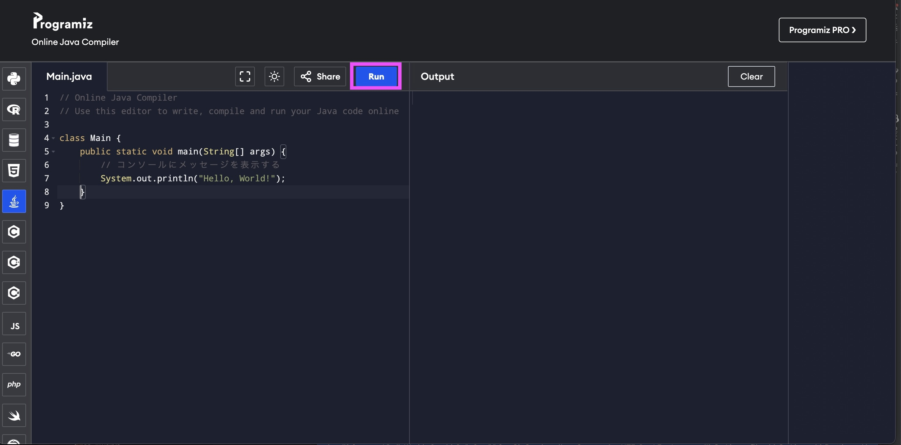
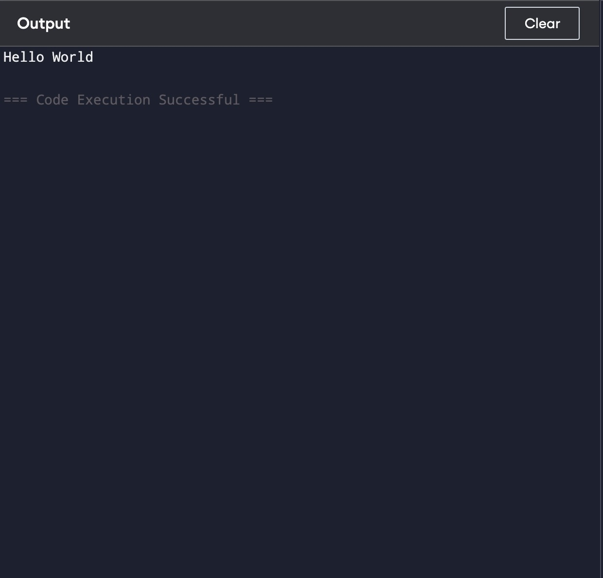

# Hello World

## JavaでHello Worldを表示しよう

最初に、Javaを使ってコンピュータに`Hello World`いう文字を表示させてみましょう。

ブラウザでJavaを実行できる環境[Online Java Compiler](https://www.programiz.com/java-programming/online-compiler/)を開きます。


### ソースコードを書く

エディタの左側にコードを書いてみてください。

```
public class Main {
    public static void main(String[] args) {
        // コンソールにメッセージを表示する
        System.out.println("Hello World!");
    }
}
```

### 実行してみよう

エディタで「Run」ボタンをクリックすると、コードが実行できます。




画面に以下のように表示していれば成功です。
``` 
Hello World
```



## コードの説明

- public class Main {}
  
  mainというクラスを作っています。

- public static void main(String[] args) {}

  プログラムがスタートする地点。おまじない。

- System.out.println("Hello World");

  コンピュータに「Hello World」と表示する命令です。
